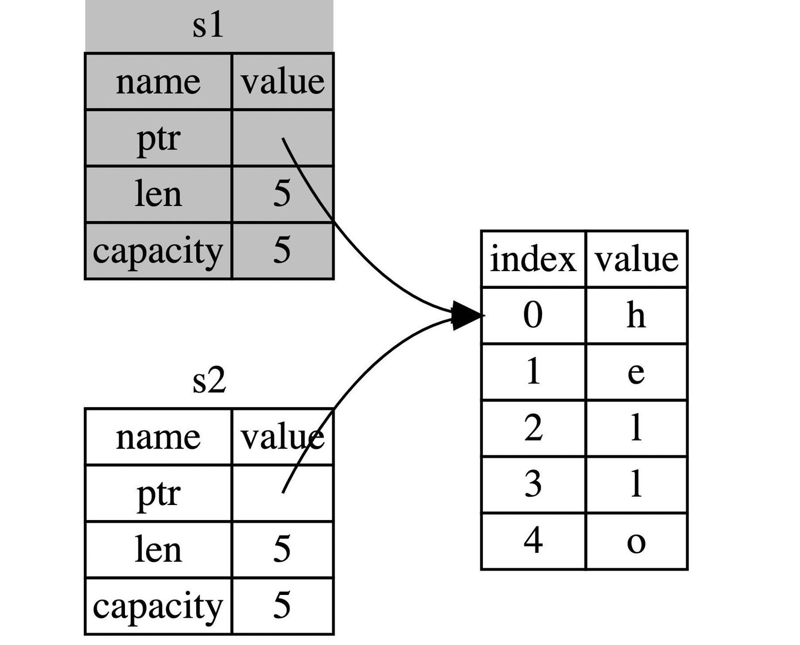

## 小技巧

### 整理溢出

要显式处理可能的溢出，可以使用标准库针对原始数字类型提供的这些方法：

- 使用 `wrapping_*` 方法在所有模式下都按照补码循环溢出规则处理，例如 `wrapping_add`
- 如果使用 `checked_*` 方法时发生溢出，则返回 `None` 值
- 使用 `overflowing_*` 方法返回该值和一个指示是否存在溢出的布尔值
- 使用 `saturating_*` 方法使值达到最小值或最大值

```rust
fn main() {
    let a : u8 = 255;
    println!("{:?}", a.wrapping_add(20));     // 19
    println!("{:?}", a.checked_add(20));      // None
    println!("{:?}", a.overflowing_add(20));  // (19, true)
    println!("{:?}", a.saturating_add(20));   // 255
}
```

## 所有权

1. Rust 中每一个值都被一个变量所拥有，该变量被称为值的所有者
2. 一个值同时只能被一个变量所拥有，或者说一个值只能拥有一个所有者
3. 当所有者(变量)离开作用域范围时，这个值将被丢弃(drop)

### 移动

**当 `s1` 被赋予 `s2` 后，Rust 认为 `s1` 不再有效，因此也无需在 `s1` 离开作用域后 `drop` 任何东西，这就是把所有权从 `s1` 转移给了 `s2`，`s1` 在被赋予 `s2` 后就马上失效了**。



### 拷贝

Rust 有一个叫做 `Copy` 的特征，可以用在类似整型这样在栈中存储的类型。如果一个类型拥有 `Copy` 特征，一个旧的变量在被赋值给其他变量后仍然可用，也就是赋值的过程即是拷贝的过程。

那么什么类型是可 `Copy` 的呢？
这里可以给出一个通用的规则： **任何基本类型的组合可以 `Copy` ，不需要分配内存或某种形式资源的类型是可以 `Copy` 的**。如下是一些 `Copy` 的类型：
- 所有整数类型，比如 `u32`
- 布尔类型，`bool`，它的值是 `true` 和 `false`
- 所有浮点数类型，比如 `f64`
- 字符类型，`char`
- 元组，当且仅当其包含的类型也都是 `Copy` 的时候。比如，`(i32, i32)` 是 `Copy` 的，但 `(i32, String)` 就不是
- 不可变引用 `&T` ，例如[转移所有权](https://course.rs/basic/ownership/ownership.html#%E8%BD%AC%E7%A7%BB%E6%89%80%E6%9C%89%E6%9D%83)中的最后一个例子，**但是注意: 可变引用 `&mut T` 是不可以 Copy的**


## 引用和借用

**引用的生命周期从借用处开始，一直持续到最后一次使用的地方**。

### 解引用

```rust
fn main() {
    let x = 5;
    let y = &x;

    assert_eq!(5, x);
    assert_eq!(5, *y); // *y = 解引用 x = *&x
}
```

## 认识生命周期

- **标记的生命周期只是为了取悦编译器，让编译器不要难为我们**
- **在通过函数签名指定生命周期参数时，我们并没有改变传入引用或者返回引用的真实生命周期，而是告诉编译器当不满足此约束条件时，就拒绝编译通过**。
- **函数的返回值如果是一个引用类型，那么它的生命周期只会来源于**：
    - 函数参数的生命周期
    - 函数体中某个新建引用的生命周期
- **三条消除规则**
    - 1. **每一个引用参数都会获得独自的生命周期**
        例如一个引用参数的函数就有一个生命周期标注: `fn foo<'a>(x: &'a i32)`，两个引用参数的有两个生命周期标注:`fn foo<'a, 'b>(x: &'a i32, y: &'b i32)`, 依此类推。
    2. **若只有一个输入生命周期(函数参数中只有一个引用类型)，那么该生命周期会被赋给所有的输出生命周期**，也就是所有返回值的生命周期都等于该输入生命周期
        例如函数 `fn foo(x: &i32) -> &i32`，`x` 参数的生命周期会被自动赋给返回值 `&i32`，因此该函数等同于 `fn foo<'a>(x: &'a i32) -> &'a i32`
    3. **若存在多个输入生命周期，且其中一个是 `&self` 或 `&mut self`，则 `&self` 的生命周期被赋给所有的输出生命周期**
        拥有 `&self` 形式的参数，说明该函数是一个 `方法`，该规则让方法的使用便利度大幅提升。

## 闭包

闭包是**一种匿名函数，它可以赋值给变量也可以作为参数传递给其它函数，不同于函数的是，它允许捕获调用者作用域中的值** ，例如：

```rust
fn main() {
   let x = 1;
   let sum = |y| x + y;

    assert_eq!(3, sum(2));
}
```

上面的代码展示了非常简单的闭包 `sum`，它拥有一个入参 `y`，同时捕获了作用域中的 `x` 的值，因此调用 `sum(2)` 意味着将 2（参数 `y`）跟 1（`x`）进行相加，最终返回它们的和：`3`。

可以看到 `sum` 非常符合闭包的定义：可以赋值给变量，允许捕获调用者作用域中的值。

### 闭包的形式定义

```rust
|param1, param2,...| {
    语句1;
    语句2;
    返回表达式
}
```

如果只有一个返回表达式的话，定义可以简化为：

```rust
|param1| 返回表达式
```

上例中还有两点值得注意：

- **闭包中最后一行表达式返回的值，就是闭包执行后的返回值**，因此 `action()` 调用返回了 `intensity` 的值 `10`
- `let action = ||...` 只是把闭包赋值给变量 `action`，并不是把闭包执行后的结果赋值给 `action`，因此这里 `action` 就相当于闭包函数，可以跟函数一样进行调用：`action()`