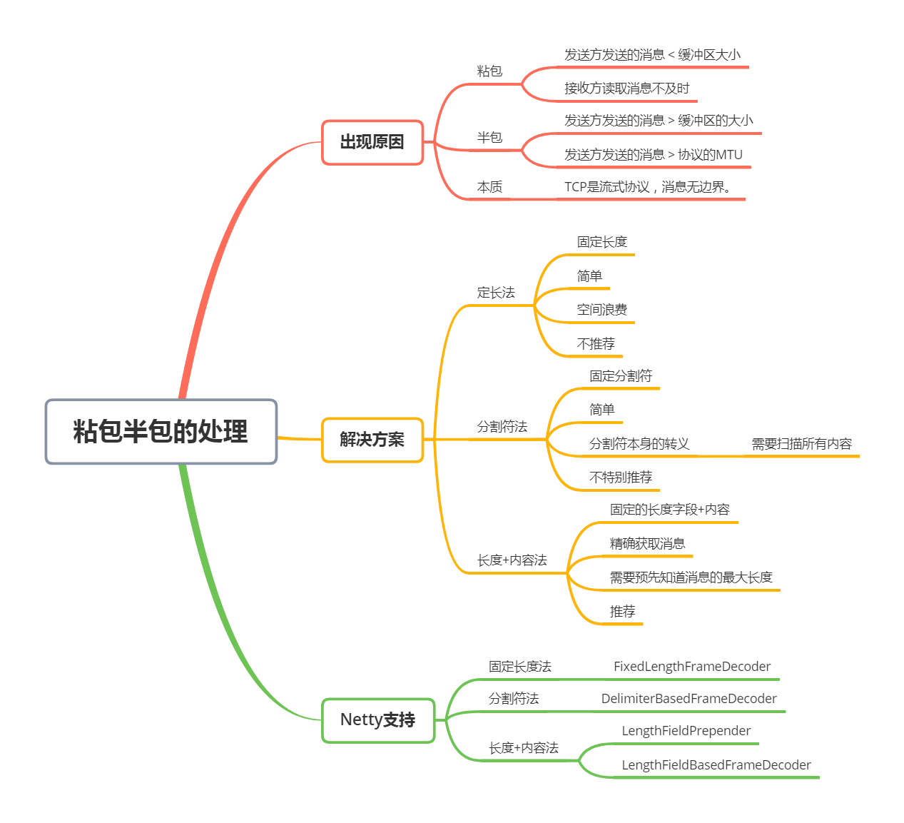
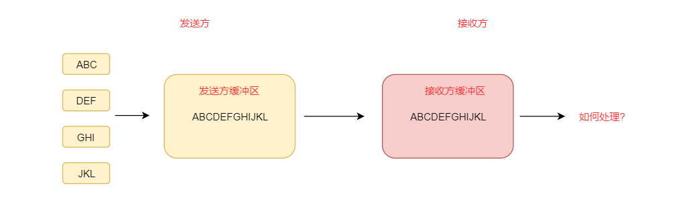
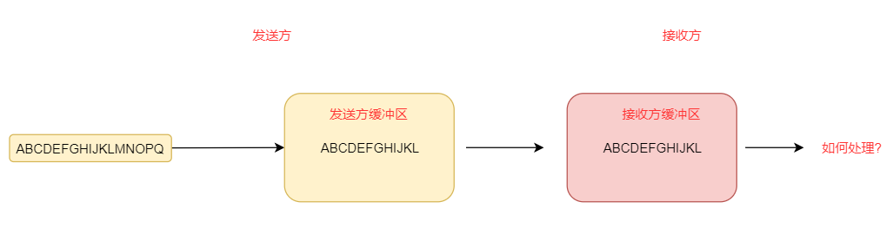
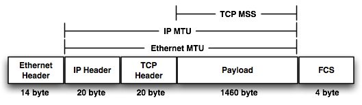
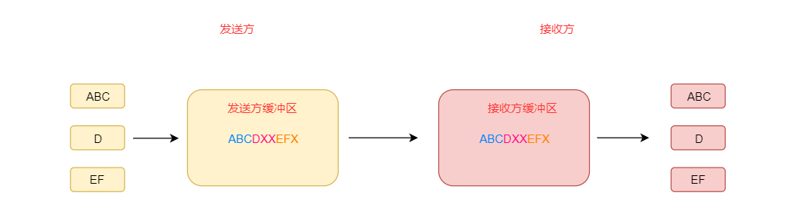
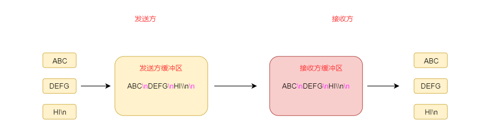
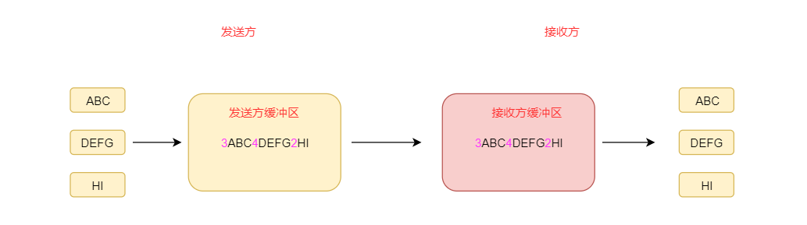
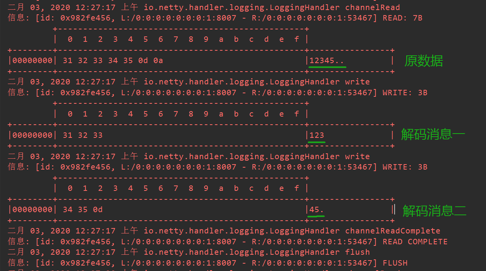

# 思维导图



# 何为粘包 / 半包？

比如，我们发送两条消息：ABC 和 DEF，那么对方收到的就一定是 ABC 和 DEF 吗？

不一定，对方可能一次就把两条消息接收完了，即 ABCDEF；也可能分成了好多次，比如 AB、CD 和 EF。


对方一次性接收了多条消息这种现象，我们就称之为**粘包现象**。

对方多次接收了不完整消息这种现象，我们就称之为**半包现象**。

# 为什么会出现粘包 / 半包？

## 粘包的原因

我们知道，TCP 发送消息的时候是有缓冲区的，当**消息的内容远小于缓冲区**的时候，这条消息不会立马发送出去，而是跟其它的消息合并之后再发送出去，这样合并发送是明显能够提高效率的。

这就好比寄快递的时候一样，不可能你寄一个快递就给你派送一样，而是先放到仓库里，等够一车了再统一装车拉走。



但是，**对方接收到的消息就是一个粘包**，无法有效区分出来到底是几条消息。

当然，接收消息也是会通过 TCP 的缓冲区的，**如果接收方读取得不及时，也有可能出现粘包现象**。

比如，缓冲区里面的 ABC 还没来得及读取，又来了一条消息 DEF，这时候两条消息就合并在一起了，也就出现了粘包了。

总结起来，出现粘包的原因无非两种：

- 发送方发送的消息 < 缓冲区大小
- 接收方读取消息不及时

## 半包的原因

类比粘包，如果发送的消息太大，已经**超过了缓冲区的大小**，这时候就**必须拆分发送**，也就**形成了半包现象**。

这就好比你发的快递太多了，一车拉不完，要分成好几车拉走一样（似乎不太常见☺）。



还有一种情况，网络协议各层是有最大负载的，所以，对应到各种协议它们是有最大发送数据的限制的，这种可以发送的最大数据称作 MTU（Maximum Transmission Unit，最大传输单元）。



所以一次发送的数据如果**超过了协议的 MTU**，也要**进行拆分发送**，也会**形成半包现象**。

总结起来，出现半包的原因有两种：

- 发送方发送的消息 > 缓冲区的大小
- 发送方发送的消息 > 协议的 MTU

## 本质原因

发送消息的时候如果消息太小，先放到缓冲区里面放着，等数据够多了再一起发送；如果消息太大，则拆成多个消息分批发送。

那么，本质原因是缓冲区吗？

当然不是，缓冲区的存在是为了提高发送消息的效率。

**本质原因是：TCP 是流式协议，消息无边界。**

TCP 协议本身像水流一样，源源不断，完全不知道消息的边界在哪里。

> UDP 协议不会出现粘包 / 半包现象，它的消息是有明确边界的，不会像 TCP 一样出现粘包 / 半包现象。
> 

# 怎么解决粘包 / 半包?

上面我们分析了出现粘包 / 半包现象的本质原因，所以我们只要能解决消息的边界是不是就可以解决粘包 / 半包问题了呢？

答案是肯定的。

所以，业界就衍生出了三种常用的解决粘包 / 半包问题的方法：**定长法、分割符法、长度 + 内容法**。

## 定长法

固定长度确定消息的边界，比如传输的消息分别为 ABC、D、EF。

那么，就找最长的那条消息，这里是 ABC，那就以 3 为固定长度，不足三位的补足三位。



所以，这种方式最大的缺点就是**浪费空间**，所以不推荐。

## 分割符法

使用固定的分割符分割消息，比如传输的消息分别为 ABC、DEFG、HI\n，假如使用 \n 作为分割符。

那么，就在消息的边界处加一个 \n 作为分割符，这样接收方拿到消息之后使用 \n 去分割消息即可。



但是，这种方式的缺点是一是**分割符本身作为传输内容时要转义**，二是**要扫描消息的内容才能确定消息的边界在哪里**，所以也不是特别推荐。

## 长度 + 内容法

使用固定的字节数存储消息的长度，后面跟上消息的内容，读取消息的时候先读取长度，再一次性把消息的内容读取出来。

比如，传输的消息分别为 ABC、DEFG、HI。

那么，就在消息前面分别加上长度一起传输，后面再跟上内容，这样即使三条消息一起传输也可以分得清清楚楚。



这种方式的缺点是**需要预先知道消息的最大长度**，但是跟这个缺点相比，优点太明显了，所以是我们推荐的方式。

## 其它方法

上面介绍了业界公认的三种处理粘包 / 半包的方法，那么，还有没有其它方法呢？

其实，可以说有，也可以说没有，万变不离其宗，这三种方法是基础。比如，使用 JSON 协议，可以通过查找匹配到的 `{`和`}` 的数量，来处理粘包 / 半包，说白了，也是一种分割符法，只不过不是基础版。

## 比较

下面是三种方法的整体比较：

| 方法 | 如何确定消息边界 | 优点 | 缺点 | 推荐度 |
| --- | --- | --- | --- | --- |
| 定长法 | 使用固定长度分割消息 | 简单 | 空间浪费 | 不推荐 |
| 分割符法 | 使用固定分割符分割消息 | 简单 | 分割符本身需要转义，且需要扫描消息的内容 | 不特别推荐 |
| 长度 + 内容法 | 先获取消息的长度，再按长度读取内容 | 精确获取消息的内容 | 需要预先知道消息的最大长度 | 推荐 |

## Netty 是如何支持的?

Netty 是通过三组类来处理粘包 / 半包问题的，分别对应于上面提到的三种方式。

| 方法 | 编码 | 解码 |
| --- | --- | --- |
| 定长法 | 无 | FixedLengthFrameDecoder |
| 分割符法 | 无 | DelimiterBasedFrameDecoder |
| 长度 + 内容法 | LengthFieldPrepender | LengthFieldBasedFrameDecoder |

细心的同学会发现，定长法和分割符法没有编码对应的类，那是因为太简单了，Netty 都懒得实现了。

细心的同学可能又发现了，为什么解码类后面都是 *FrameDecoder 呢？那是因为被解码之后的消息又叫作一帧一帧的消息，所以称为 “帧解码器”。

那么，在 Netty 中如何使用它们呢？

其实，使用方法非常简单，只需要在 childHandler 中添加一个解码器就可以了，比如，以 `FixedLengthFrameDecoder`为例：

```java
public final class EchoServer {

    static final int PORT = Integer.parseInt(System.getProperty("port", "8007"));

    public static void main(String[] args) throws Exception {
        // 省略其它代码
                    .childHandler(new ChannelInitializer<SocketChannel>() {
                        @Override
                        public void initChannel(SocketChannel ch) throws Exception {
                            ChannelPipeline p = ch.pipeline();
                            p.addLast(new LoggingHandler(LogLevel.INFO));
                            // 添加固定长度解码器，长度为3
                            p.addLast(new FixedLengthFrameDecoder(3));
                            p.addLast(echoServerHandler);
                        }
                    });
        // 省略其它代码
    }
}
```

启动服务器，使用 XSHELL 连接到服务器，并发送一串数字 “12345”，看看控制台的日志：



可以看到，我们收到的消息为 “12345…”，后面的两个点一个是回车符 “\r”，一个是换行符 “\n”，然后看发送的消息，一个是 “123”，一个是 “45.”，还有一个点，不够三位，所以不会发送。

> 回车符的作用是输入完一行内容后光标回到当前行的开头却不向下移一行。
换行符的作用是跳到下一个新行，输入完一行内容后光标下移一行却不会移到这一行的开头。
不过，不同的操作系统表现上来说略有区别。
> 

是不是超级简单呢？编解码器可以说是 Netty 的一大灵魂所在，也是 Netty 好用的地方。

# 相关性
- [Netty-02.Netty的常见编码方式](Netty-02.Netty的常见编码方式)
	在解决粘包/半包问题后，二次编解码（将字节数组转化为对象）