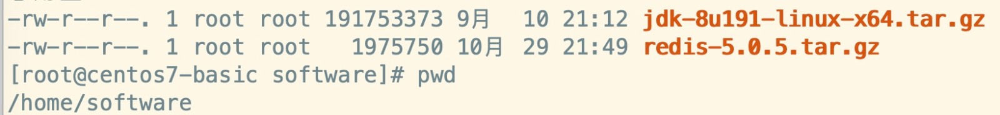

### **下载**

官网：[https://redis.io/download](https://redis.io/download)

选择下载稳定版本，不稳定版本可以尝鲜，但是不推荐在生产使用。

### **上传至linux**

### **安装 Redis**

1. 解压redis：
    
    **tar -zxvf redis-5.0.5.tar.gz**
    
    得到：
    
    
    
2. 安装gcc编译环境，如果已经安装过了，那么就是 nothing to do
    
    **yum install gcc-c++**
    
3. 进入到 **redis-5.0.5** 目录，进行安装：
    
    **make && make install**
    
    执行完毕后安装成功
    
4. 配置redis，在utils下，拷贝**redis_init_script**到**/etc/init.d**目录，目的要把redis作为开机自启动创建 /usr/local/redis，用于存放配置文件
    
    
    
5. 创建 /usr/local/redis，用于存放配置文件
    
    
    
6. 拷贝redis配置文件：
    
    
    
7. 拷贝到 /usr/local/redis 下
    
    
    
8. 修改redis.conf这个核心配置文件
    1. 修改 daemonize no -> daemonize yes，目的是为了让redis启动在linux后台运行
        
        
        
    2. 修改redis的工作目录：
        
        
        
    3. 建议修改为： /usr/local/redis/working，名称随意
    4. 修改如下内容，绑定IP改为 0.0.0.0 ，代表可以让远程连接，不收ip限制
        
        
        
    5. 最关键的是密码，默认是没有的，一定要设置
        
        
        
    6. 并且修改redis核心配置文件名称为：6379.conf
    7. 为redis启动脚本添加执行权限，随后运行启动redis:
        
        
        
    8. 检查redis进程：
        
        
        
        到此redis安装并且启动成功！
        
    9. 设置redis开机自启动，修改 redis_init_script，添加如下内容
        
        
        
        随后执行如下操作：
        
        **chkconfig redis_init_script on**
        
        重启服务器(虚拟机)后，再看进程：
        
        
        
        OK，没毛病